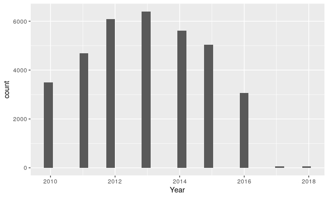

Summary
=======

The data set is based the Big Cities Health Inventory (BCHI) which is an
open data platform managed by Big Cities Health Coalition (BCHC). It
contains a collection of data representing a snapshot from 30 large
cities in the United States of America. The objective of this project is
to gain insights from the health dataset, find out which diseases are
more prevalent and major cause of mortality in urban environment, raise
awareness about certain diseases which are not familiar to general
public, try to predict which disease a person is likely to have given a
set of variables like city, age, sex.

The dataset is available in .csv format containing 15 columns/variables
which includes indicator category, indicator, age, year, sex,
race/ethnicity, value, place, etc. The categories of diseases are merged
in observations and hence will require tidying up the data a little bit
to create variables of interest. Apart from this a certain number of
data preprocessing steps are required to clean up the data and produce
insights from it. Consequently, it is planned to produce various
insights from the data in the form of visualizations and find
correlations and other patterns in the data, to help in modelling and
produce interesting results.

Proposed Plan of Research
=========================

The plan of approach is to utilize this data to produce non-trivial
inferences by waging the indicator data to different causal variables.
The process starts from cleaning the data to increase the usability and
understandability by cleaning out the empty fields, manipulation of the
records for variables such as Methods, Notes etc. to replace the
sentences with some meaningful strings which would provide better
setting for analysis. The time series data (years) which would be used
to analyze the distribution of diseases based on the confidence levels
over the years using visualization techniques and produce inferences.
Additionally, it is planned to use visualization techniques to express
the mortality rates for different indicator categories distributed over
the cities. The dataset mostly contains categorical variables and a few
continuous variables so the plan is to create classification models from
the data, which would be used to predict diseases a person is likely to
have based on various given factors.

Preliminary Results
===================

Successfully loaded dataset into R and began performing exploratory
analysis to understand the overall scope of dataset. Performed tidying
on data set, cleaned the records with empty demographic values. Started
with string extraction on variables to extract essential information and
reject the rest to increase understandability of data. From (Figure 1) a
trend of diseases over the years can be seen and some information from
the years 2017 and 2018, which cannot be used as that data is not
sufficient.

Citations
=========

[9] *Big Cities Health Coalition (BCHC)* 2010-2016,
<https://www.bigcitieshealth.org/>. *Centers for Disease Control and
Prevention*, <https://www.cdc.gov/brfss/index.html>

Appendix
========

List of Figures:

